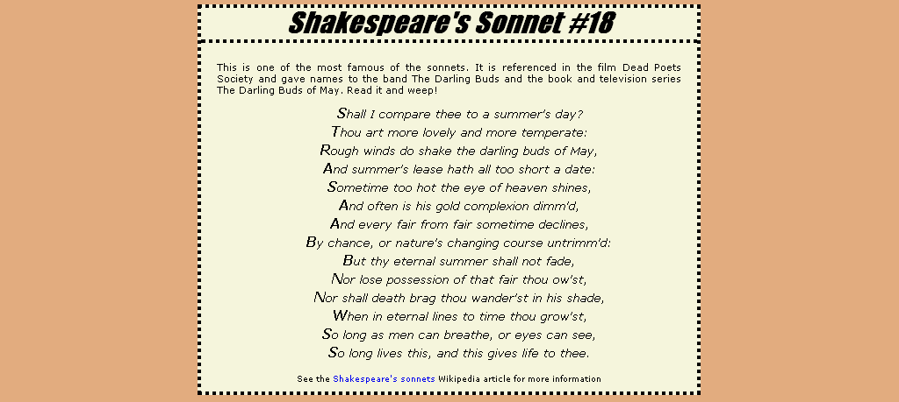

# CSS Reverse Engineering

## Description

Given screenshots of web pages (or parts of webpages), reproduce the look of each using CSS.

## Tasks
```markdown
* [ ] Blank slate
  * [ ] Create a CodePen account
* [ ] Normal mode
  * [ ] Create a pen for the Shakespeare sonnet
  * [ ] Create a pen for the complicated button
* [ ] Hard mode
  * [ ] Create a pen for the GitHub repositories page
* [ ] Nightmare mode
  * [ ] Create a pen for the Surf and Paddle co. page
```


## Objectives

After completing this assignment, you should...

* Understand the structure of HTML documents
* Understand CSS selectors, styles, and attributes
* Understand CSS pseudo-selectors
* Use online tools like Codepen for rapid HTML and CSS experimentation
* Create simple HTML documents
* Style them with simple CSS documents

## Deliverables

* Links to your pens

## Normal Mode

Your goal today is to reproduce webpages or components of webpages that you might find on the web.

Your work will probably proceed like this:

* Set up an account with codepen.io
* Build a new "pen"
* As you change HTML or CSS, the view of the page below will automatically refresh, but you do need to save before your changes stick around
* When you are finished with each task of this assignment, copy the link from your address bar and submit it as an issue in the assignments repo

#### Task 1

The first task is to make a (terribly ugly) webpage containing one of Shakespeare's sonnets. You will be making a webpage in Codepen that looks exactly like this:



So that you don't have to re-type the whole thing, [here is the sonnet in text form](http://www.poetryfoundation.org/poem/174354). Pay attention to all the details, from color to font to borders. Look down in the resources section for a tool that will help you compare your work with this image.

#### Task 2

The second task is to make the following button:


The trick here is that you have to do all the work in CSS. Your HTML must look exactly like this:

```html
<span id="checkout">Checkout</span>
```

You'll need to look up and understand CSS "pseudo-selectors" to get this to work. You'll probably also get confused about how to do things like multiple borders. As with everything you don't know in software development, the best approach is to Google for something like "CSS multiple borders" and find a good post that describes how it can be done.

Try to make this pixel-perfect!

## Hard Mode

Take a look at your GitHub repositories page. [Here is an example](https://github.com/jamesmallen?tab=repositories).

There's a lot going on on this page, but it's not ridiculous. For hard mode, recreate this page with as much precision as you can, but don't worry about getting all the information on the page right. Just start at the top and try to create the menu bar, then work on the left column, then try the right. Say gibberish if you would like, but DO NOT copy and paste anything from GitHub's source.

## Nightmare Mode

The third task is much, much harder, but if you'd like to really learn a lot about HTML and CSS, try to reproduce the following webpage:


To get this to work, you'll need to use a liberal number of nested elements, and will have to understand concepts like CSS positioning and CSS floating. But really, don't keep yourself up late on Nightmare Mode. This is just for those with extra time who want to poke around more (and it's a full Front End Engineering assignment in itself).

CodePen doesn't allow you to upload images with the free version, so you'll need to either find a source of images that allow hotlinking, or store your files elsewhere, such as a GitHub repo.

## Additional Resources

* Mac's built-in screenshotting tool (Command + Shift + 4, then draw a box around what you want).
* [Sip.app](https://itunes.apple.com/us/app/sip/id507257563?mt=12) for picking colors.
* [PerfectPixel](http://www.welldonecode.com/perfectpixel/) for checking pixel precision.
* I already mentioned this, but [Google](http://www.google.com)!
